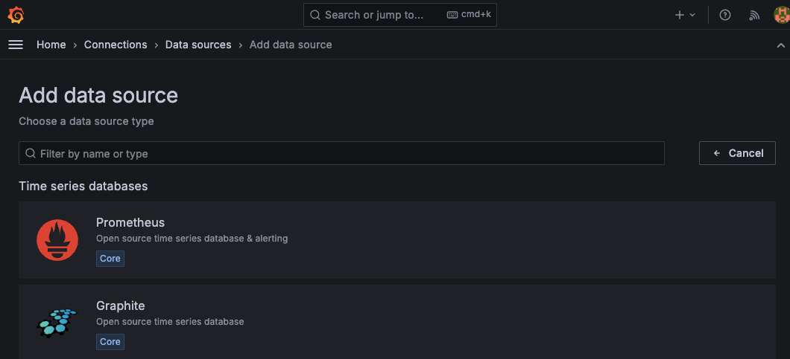

# メトリックス監視

CPUとメモリの使用率、ディスクへの書き込みと読み取りの速度など、数値化されるデータを収集して、視覚化します。
定番のGrafanaとPrometheousを使用した例を紹介します。


## Minikubeのセットアップ
グラフィカルな表示などに、CPUとメモリを必要とするので、メモリ7G CPU４コアを設定します。
読者の環境によっては動かせないかもしれませんのが、ご了承ください。
デフォルトのストレージクラスに csi-hostpath を設定します。
このセットアップは、次節のロギングでも使用します。

```
$ minikube start --memory='7g' --cpus='4'
$ minikube addons disable storage-provisioner
$ minikube addons disable default-storageclass
$ minikube addons list
$ minikube addons enable ingress
$ minikube addons enable csi-hostpath-driver
$ kubectl patch storageclass csi-hostpath-sc -p '{"metadata": {"annotations":{"storageclass.kubernetes.io/is-default-class":"true"}}}'
$ kubectl get sc
```

## 時系列データベースのプロメテウスをインストール
プロメテウスをHelmを使用してインストールします。Helmのインストールは参考資料を参照してインストールしてください。

```
$ helm repo add prometheus-community https://prometheus-community.github.io/helm-charts
$ kubectl create ns monitoring
$ helm install -n monitoring prometheus prometheus-community/prometheus
```

## 視覚化ツールのグラファナのインストール
こちらも、Helmを使用してインストールします。

```
$ helm repo add grafana https://grafana.github.io/helm-charts
$ helm install -n monitoring grafana grafana/grafana
```


## グラファナへのアクセス
グラファナのポッドが、すべて Running になるまで待ちます。
```
$ kubectl get po -n monitoring
NAME                                                READY   STATUS    RESTARTS   AGE
grafana-58497f6f96-cxdw6                            1/1     Running   0          38s
prometheus-alertmanager-0                           1/1     Running   0          49s
prometheus-kube-state-metrics-f7c68b84f-szb5s       1/1     Running   0          49s
prometheus-prometheus-node-exporter-fs9f6           1/1     Running   0          49s
prometheus-prometheus-pushgateway-568fbf799-pld7f   1/1     Running   0          49s
prometheus-server-6949d6cfdd-npxlr                  1/2     Running   0          49s
```

グラファナにログインするためのパスワードを取得します。
```
$ kubectl get secret -n monitoring grafana -o jsonpath="{.data.admin-password}" | base64 --decode ; echo
```

グラファナのポッド名を取得して、ポートフォワードします。
```
$ export POD_NAME=$(kubectl get pods -n monitoring -l "app.kubernetes.io/name=grafana,app.kubernetes.io/instance=grafana" -o jsonpath="{.items[0].metadata.name}")
$ echo $POD_NAME
$ kubectl -n monitoring port-forward $POD_NAME 3000
```

## Grafanaのセットアップ

### データソースの設定
ブラウザから以下のURLをアクセスします。

http://localhost:3000/


以下の認証情報で、グラファナへログインします。
  ユーザー: admin
  パスワード: 上記シークレットから取得した値


データソースにPrometheusの選択します<p>




PrometheusデータベースのURLアドレス 'http://prometheus-server' をインプットします。
<p>


それ以外はデフォルトのままで、「Save & test」をクリックします。


### ダッシュボードの設定

Dashboads -> Newボタン　-> import

Grafana.com dashboard URL or ID のフィールドに1860をインプットします。


## クリーンナップ
```
$ minikube delete
```


## 参考資料

Helmコマンドのインストール
- https://helm.sh/docs/intro/install/

プロメテウスのインストール
- https://github.com/prometheus-community/helm-charts
- https://prometheus.io/

グラファナのインストール
- https://grafana.com/docs/grafana/latest/setup-grafana/installation/helm/
- https://grafana.com/

グラファナダッシュボード
- https://grafana.com/grafana/dashboards/