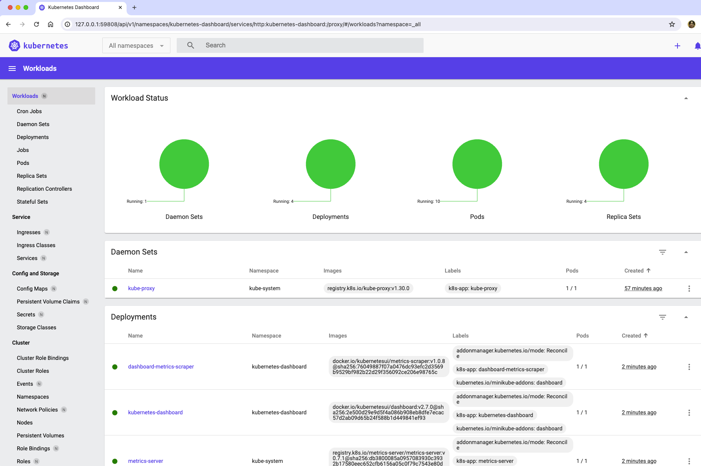

## ダッシュボード

Kubernetesのプロジェクトで開発された機能で、Kubernetesクラスタ上の全てのオブジェクトをブラウザで参照できます。


## ダッシュボードの起動方法
```
minikube start
minikube addons enable metrics-server
minikube addons enable dashboard
minikube dashboard --url
```
自動的にブラウザが開いて、ダッシュボードが表示されます。ブラウザが起動しない時は、表示されたURLアドレスをアクセスしてください。


<p>ダッシュボードのスクリーンショット<p>



## クリーンナップ
```
minikube delete
```


## 参考資料
- https://kubernetes.io/docs/tasks/access-application-cluster/web-ui-dashboard/