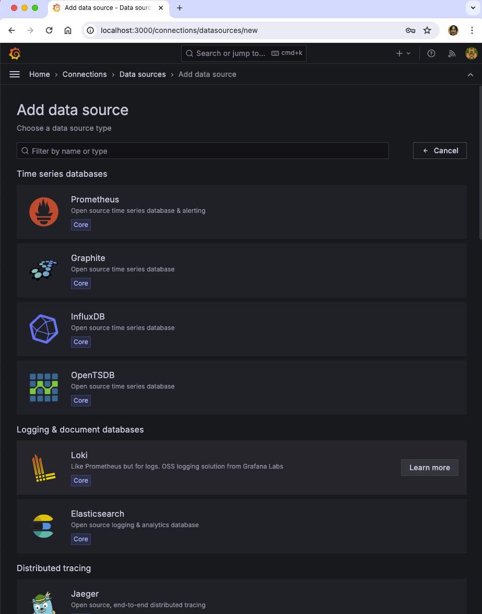
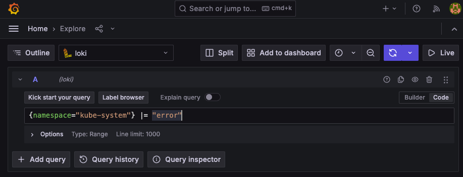

## Lokiのインストール


## Minikubeのセットアップ
グラフィカルな表示などに、CPUとメモリを必要とするので、メモリ7G CPU４コアを設定します。
読者の環境によっては動かせないかもしれませんのが、ご了承ください。
デフォルトのストレージクラスに csi-hostpath を設定します。
このセットアップは、次節のロギングでも使用します。

```
$ minikube start --memory='7g' --cpus='4'
$ minikube addons disable storage-provisioner
$ minikube addons disable default-storageclass
$ minikube addons list
$ minikube addons enable ingress
$ minikube addons enable csi-hostpath-driver
$ kubectl patch storageclass csi-hostpath-sc -p '{"metadata": {"annotations":{"storageclass.kubernetes.io/is-default-class":"true"}}}'
$ kubectl get sc
```


## Lokiのインストール

```
$ kubectl create ns monitoring
$ helm repo add grafana https://grafana.github.io/helm-charts
$ helm repo update
# helm inspect values grafana/loki > values2.yml
$ helm install -n monitoring --values values.yaml loki grafana/loki-stack 
```

ポッドが起動して稼働状態になるまで待ちます。
```
$ kubectl get po -n monitoring 
NAME                  READY   STATUS    RESTARTS   AGE
loki-0                0/1     Running   0          19s
loki-promtail-8w97j   0/1     Running   0          19s

# 以下の状態になるまで待つ
$ kubectl get po -n monitoring 
NAME                  READY   STATUS    RESTARTS   AGE
loki-0                1/1     Running   0          81s
loki-promtail-8w97j   1/1     Running   0          81s
```


## グラファナのインストール
前章のグラファナのインストールと同じです。

```
$ helm repo add grafana https://grafana.github.io/helm-charts
$ helm install -n monitoring grafana grafana/grafana
$ kubectl get po -n monitoring
```


## グラファナのセットアップ

グラファナにログインするためのパスワードを取得します。
```
$ kubectl get secret -n monitoring grafana -o jsonpath="{.data.admin-password}" | base64 --decode ; echo
```

グラファナのポッド名を取得して、ポートフォワードします。
```
$ export POD_NAME=$(kubectl get pods -n monitoring -l "app.kubernetes.io/name=grafana,app.kubernetes.io/instance=grafana" -o jsonpath="{.items[0].metadata.name}")&& echo $POD_NAME
$ kubectl -n monitoring port-forward $POD_NAME 3000
```

<p>



上記の画面からLogiをクリックして、
Connectionに次のURLをセットする
http://loki.monitoring.svc.cluster.local:3100

画面下の「Save & test」のボタンをクリック


## ログの検索
Kubernetesのコントロールプレーンで発生したログを表示してみる。

メニューアイコン（通称ハンバーガーアイコン）からExploreを選択

1. Label browserをクリック　namespace をクリック
2. 表示されたネームスペースの中から、kube-system をクリック
3. Show logs をクリック


メニュー -> Explore で表示される画面に、以下の検索式をコピペします。
'{namespace="kube-system"} |= "error"'

<p>



検索結果が、同一画面の下に表示されます。
<p>


## クリーンナップ
```
$ minikube delete
```


## 参考資料
- https://grafana.com/docs/loki/latest/setup/install/helm/install-monolithic/
- https://grafana.com/docs/grafana/latest/explore/logs-integration/
